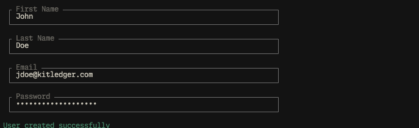

# Getting Started

## Installation


## Your first user

Kitledger provides a helper command for creating users. This is typically only required on initial system setup as at least one user needs to exist before accessing the admin UI.
That said, a system admin can keep using the CLI to create additional users in the future if needed. The base requirement is privileged system access in order to be able to run commands in the first place.

```bash
composer run create-user
```

This command will render a form that will prompt for the base information needed to create a system user. Please fill out the information and press enter at each step to proceed. At the end, the system will indicate that the user was creatd correctly. 



## Creating Access Tokens

Another command is provided to generate API access tokens for a given user from the CLI. This command is useful for local testing cases or cases where there's no access to a GUI that can handle access token creation.

```bash
composer run create-access-token
```

This command will render a **search** prompt. Upon typing into it, a list of users that match or are close to matching the search term will appear as results. Once the list is short enough, you can use arrow keys and the enter button to select the desired user.


After that, the plain text token will be displayed **only once**. This token should be stored securely, as it can provide a bad actor with access to the system.


